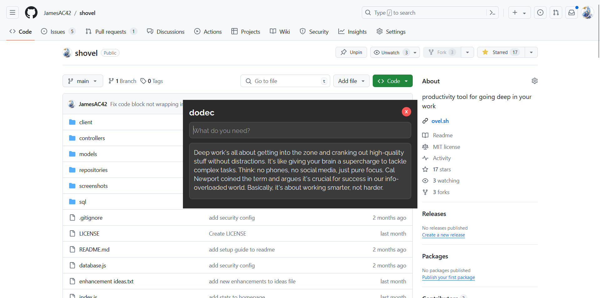

## dodec

dodec lets you talk to a cool language model assistant with a simple keystroke.

a lot of times I'm in the middle of doing something and suddenly want to ask an LLM something.

but opening my browser and making a new chat and then asking is a lot of work.

googling is the default but google search results are just bad nowadays.

with dodec I can just do Ctrl+Alt+Enter and a little chat prompt opens up immediately, wherever I am.

I can have a little one off conversation and then close the window with Shift+Backspace.

It's so easy. In fact, my use of LLMs has gone up dramatically since creating this.

I've even begun talking to it for fun, which is something I never did before.

Try it out

### How to use

Dodec uses the Claude 3.5 Sonnet model via Anthropic's API.

You need to have python installed first.

Clone the repo.

In the project directory, run `python -m venv claude-env`

Then run `pip install anthropic`

Then get an API key for anthropic and set it to an environment variable.

In Windows do: `setx ANTHROPIC_API_KEY "your-api-key-here"`

In linux/mac do: `export ANTHROPIC_API_KEY='your-api-key-here'`

To run dodec with a hotkey, install AutoHotKey and run the hotkey script in the repo, `RunDodec.ahk`

Now you can do `Ctrl+Alt+Enter` to run dodec and then `Shift+Backspace` to close

Or change the hotkeys to whatever you want.